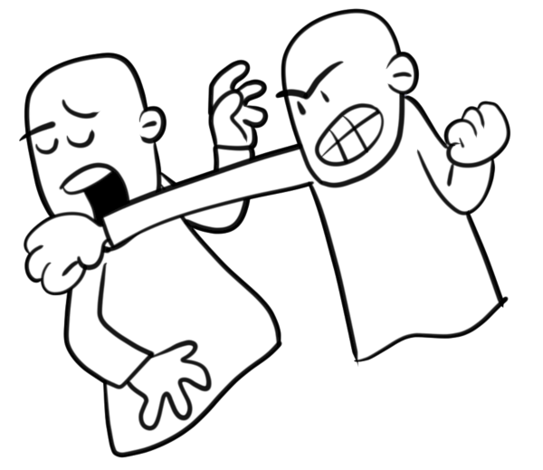
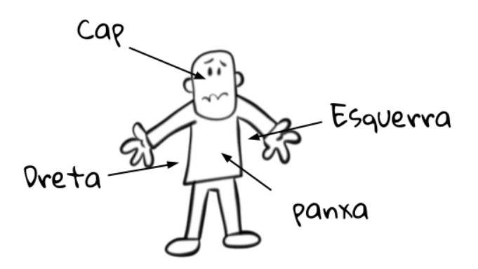

# Boxa entre cavallers

La “boxa entre cavallers” és un tipus de boxa pensada per gent educada i d’ordre.

## Normes

En aquest tipus de boxa en comptes de deixar que els lluitadors es piquin quan vulguin els lluitadors es piquen seguint unes normes molt senzilles

### Norma 1

Els combatents es van picant alternativament en ordre. Si lluiten A contra B:

- Primer pica A mentre B es protegeix
- Després pica B mentre A es protegeix

I es va repetint fins que un dels dos cau a terra.

### Norma 2

Cada boxejador pot picar en quatre llocs diferents del seu contrincant (cap, costat esquerre, costat dret i panxa).

Les proteccions que pot fer un boxejador són perfectes. Això vol dir que si rep un cop en una protecció, no rebrà cap mal. Però el que es protegeix només pot protegir tres llocs. Això vol dir que sempre pot rebre un cop en un lloc desprotegit

Si algú pica en un altre lloc, pot ser desqualificat si ho fa més d’un cop seguit

### Norma 3

Abans de començar el combat es tria qui és el primer de picar de forma aleatòria

## Versions

Podeu trobar versions del programa en diferents llenguatges en les diferents branques:

- VersioCSharp (C#)
- VersioJava (Java)
- VersioPython (Python)
- VersioRust (Rust)
- VersioGo (Go)
